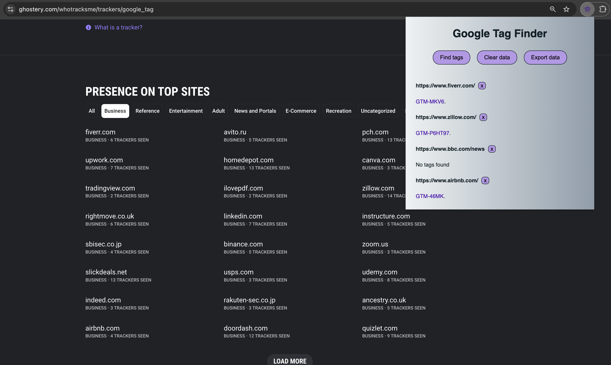

# Tag finder

This is a prototype chrome extension app to demomstrate how [Google tags](https://developers.google.com/tag-platform/gtagjs) can be used to discover website connections through tracking codes. I got the idea [here](https://www.bellingcat.com/resources/2017/07/31/automatically-discover-website-connections-tracking-codes/), from this Bellingcat article. Google tags can be added to websites to facilitate the use of google analytics and advertising products. According to the [Ghostery](https://www.ghostery.com/whotracksme/trackers/google_tag) tracker database, they are one of the most prevalent trackers on the web. 

### Basic functionality
- The [chrome.storage](https://developer.chrome.com/docs/extensions/reference/api/storage) api is used to store and retrieve data from the browser extension stroage.
- A [content script](https://developer.chrome.com/docs/extensions/develop/concepts/content-scripts) is used to retrieve data from the active browser page.
- [Regex](https://developer.mozilla.org/en-US/docs/Web/JavaScript/Guide/Regular_expressions) is used to parse out the tag id's.
- The identified tag id's are rendered as links that redirect to a [dnslytics](https://dnslytics.com/reverse-analytics/) site that performs a reverse lookup on the tag id.
- A [Blob](https://developer.mozilla.org/en-US/docs/Web/API/Blob) object is used to create a function to export the data to JSON if needed.

### Usage
**Git clone** the repo, and then follow instructions on [google documentation](https://developer.chrome.com/docs/extensions/get-started/tutorial/hello-world) to load an unpacked extension.

  

### Possible improvements

This is just a simple prototype for demo purposes, but possible future improvements could include:

1. **State Management**:
State is maintained using global variables (tagData, unmatchedUrlList) and also browser storage. A more consistent state management approach could avoid sync issues.
3. **Link Handling**:
Since anchor tags are created via innerHTML, they don't function well in incognito browsers. Could use Chrome's tabs API for links to ensure they open correctly in incognito mode.
5. **Code Structure**:
The event listener setup is outside any initialization function, which works but may cause issues if DOM elements don't exist when the script runs. Also some repetition of document.querySelector() calls.
7. **Performance Optimizations**:
There is probably too much clearing and re-rendering of the DOM which could be made more effiecient.
8. **UX/UI**:
UI is very minimal since it's just a demo. Might be worth implementing some front end libraries like React. Manual DOM manipulation can become tedious with more complicated UI's. 

