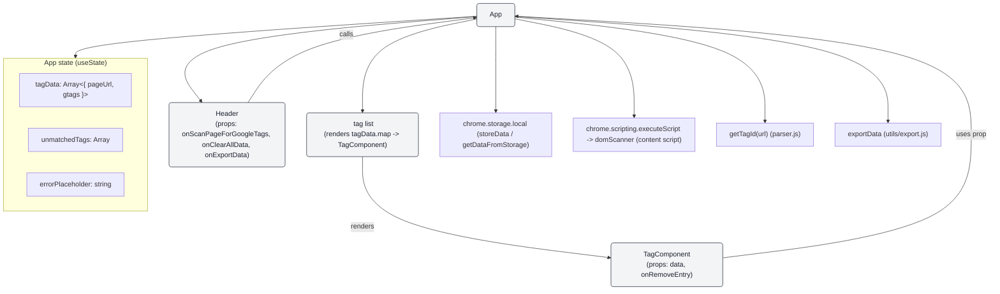

# Tag finder

This is a prototype Chrome extension app to demonstrate how [Google tags](https://developers.google.com/tag-platform/gtagjs) can be used to discover website connections through tracking codes. I originally wrote it with static HTML, CSS, and JavaScript, but then rebuilt it to the current version using React and Vite. I got the idea [here](https://www.bellingcat.com/resources/2017/07/31/automatically-discover-website-connections-tracking-codes/), from this Bellingcat article. Google tags can be added to websites to facilitate the use of Google Analytics and advertising products. According to the [Ghostery](https://www.ghostery.com/whotracksme/trackers/google_tag) tracker database, Google tags are one of the most prevalent trackers on the web.

### Basic functionality

- The [chrome.storage](https://developer.chrome.com/docs/extensions/reference/api/storage) API is used to store and retrieve data from the browser extension storage.
- A [content script](https://developer.chrome.com/docs/extensions/develop/concepts/content-scripts) is used to retrieve data from the active browser page.
- [Regex](https://developer.mozilla.org/en-US/docs/Web/JavaScript/Guide/Regular_expressions) is used to parse out the tag IDs.
- The identified tag id's are rendered as links that redirect to a [dnslytics](https://dnslytics.com/reverse-analytics/) site that performs a reverse lookup on the tag id.
- A [Blob](https://developer.mozilla.org/en-US/docs/Web/API/Blob) object is used to create a function to export the data to JSON if needed.

### Usage

Clone the repo, install dependencies and run the build command for Vite.

```bash
git clone https://github.com/seancvr/tag_finder.git
npm install
npm run build
```

and then follow instructions on the [Google documentation](https://developer.chrome.com/docs/extensions/get-started/tutorial/hello-world) to load an unpacked extension. Note in the case of a Vite + React app it will be the /dist folder you will provide to load the unpacked extension.

<p align="center">
  
</p>

# Component tree and state hierarchy

Below is a Mermaid flowchart that visualizes the component tree and main App state for the `tag_finder` React app.



### Possible improvements

This is just a simple prototype for demo purposes, but possible future improvements could include:

1. **Performance & state management**:
   Currently state is passed through props down the component tree. This could be better handled using the built in useContext hook in React or a state management tool like Redux.
2. **Type safety and validation**:
   Could add better type safety with TypeScript or PropTypes.
3. **Code structure and logic separation**:
   There is definitely a better way to structure this app to make it more maintainable and efficient, but for now the basic functionality works.
4. **UX/UI**:
   Even though the app was migrated from static HTML and JavaScript, the UI is still very minimal. Managing UI rendering was becoming complex in the original version, but React has made maintaining and enhancing the UI more manageable.
5. **Error Handling**:
   Since it's a demo app, the error handling is currently minimal, but for heavier use the error handling would need to be more robust.
