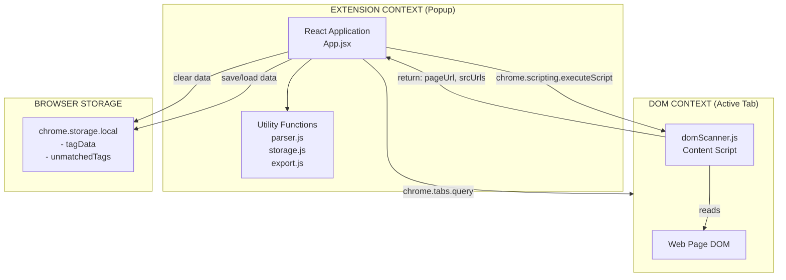
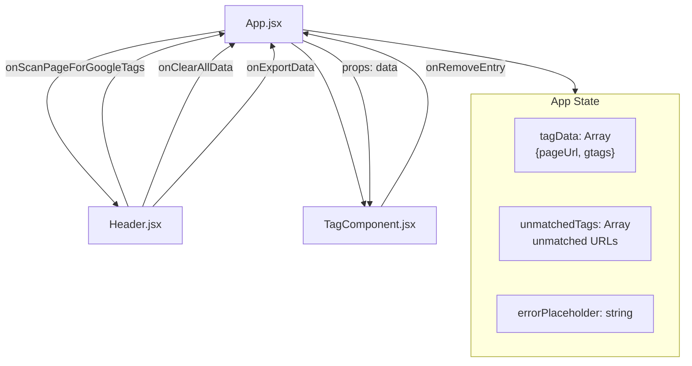

# Chrome Extension Architecture Diagrams

## Diagram 1: Browser Contexts & Communication

```mermaid
flowchart TD
    subgraph ExtensionContext["EXTENSION CONTEXT (Popup)"]
        ReactApp["React Application<br/>App.jsx"]
        Utilities["Utility Functions<br/>parser.js<br/>storage.js<br/>export.js"]
        ReactApp --> Utilities
    end

    subgraph DOMContext["DOM CONTEXT (Active Tab)"]
        WebPage["Web Page DOM"]
        DomScanner["domScanner.js<br/>Content Script"]
        DomScanner -->|reads| WebPage
    end

    subgraph BrowserStorage["BROWSER STORAGE"]
        StorageData["chrome.storage.local<br/>- tagData<br/>- unmatchedTags"]
    end

    ReactApp -->|chrome.tabs.query| DOMContext
    ReactApp -->|chrome.scripting.executeScript| DomScanner
    DomScanner -->|return: pageUrl, srcUrls| ReactApp

    ReactApp -->|save/load data| StorageData
    ReactApp -->|clear data| StorageData
```

## Diagram 2: React Component Tree & State

```mermaid
flowchart TD
    App["App.jsx"]

    subgraph AppState["App State"]
        tagData["tagData: Array<br/>{pageUrl, gtags}"]
        unmatchedTags["unmatchedTags: Array<br/>unmatched URLs"]
        errorPlaceholder["errorPlaceholder: string"]
    end

    Header["Header.jsx"]
    TagComponent["TagComponent.jsx"]

    App --> AppState
    App --> Header
    App --> TagComponent

    Header -->|onScanPageForGoogleTags| App
    Header -->|onClearAllData| App
    Header -->|onExportData| App

    TagComponent -->|onRemoveEntry| App
    App -->|props: data| TagComponent
```