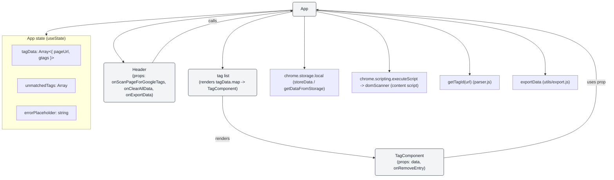

# Component tree and state hierarchy for tag_finder React app

Below is a Mermaid flowchart that visualizes the component tree and main App state for the `tag_finder` React app.

How to use

- You can paste the above Mermaid block into any Markdown file (GitHub, GitHub Pages, or other Mermaid-enabled renderers) to visualize the diagram.
- If you'd like an SVG/PNG export, tell me and I can generate and add it to the repo.
